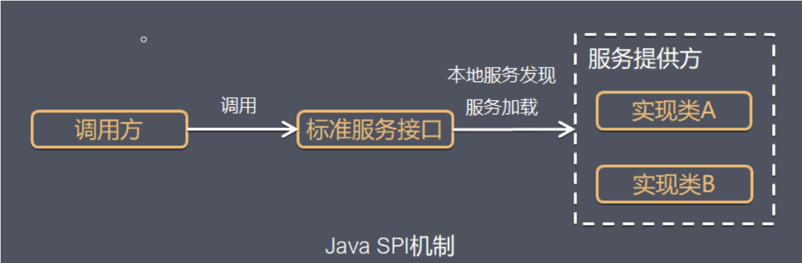

## 一. SPI介绍

SPI(Service Provider Interface),JDK内置提供的服务发现机制。SPI是一种用于动态加载服务的机制， 核心思想就是解耦。



Java SPI主要包括四个要素：

- SPI接口：为服务提供者（SPI接口实现者）提供规范的接口或抽象。

- SPI实现类：服务提供者实现SPI接口，提供真实的服务。

- SPI配置：Java SPI机制约定的配置文件，配置文件位于resources目录下的/META-INF/services目录下， 且文件名必须为SPI接口的全类名，文件内容则为SPI实现类的全类名。

- SPI加载：通过Java SPI的核心类实现加载SPI实现类。实现类为ServiceLoader.load(SPI接口.class)来加载SPI配置。

## 二. SPI使用

SPI使用案例：com.interview.java.spi

## 三. SPI原理

Java SPI机制是依赖于ServiceLoader类去解析、加载服务的，所以需要掌握ServiceLoader的工作流程。

以下是ServiceLoader类中的成员变量介绍：

```java
public final class ServiceLoader<S>
        implements Iterable<S> {
    // Java SPI配置文件所在目录
    private static final String PREFIX = "META-INF/services/";

    // Java SPI将要加载的服务类型 （SPI接口）
    // The class or interface representing the service being loaded
    private final Class<S> service;

    // 用于加载SPI服务的类加载器
    // The class loader used to locate, load, and instantiate providers
    private final ClassLoader loader;

    // 访问控制上下文
    // The access control context taken when the ServiceLoader is created
    private final AccessControlContext acc;

    // SPI服务缓存
    // Cached providers, in instantiation order
    private LinkedHashMap<String, S> providers = new LinkedHashMap<>();

    // 懒查询迭代器
    // The current lazy-lookup iterator
    private LazyIterator lookupIterator;
}

```

### 3.1 ServiceLoader类的工作流程

1. 应用程序加载Java SPI服务，都是通过调用ServiceLoader.load()方法开始的。

ServiceLoader.load()方法的作用是：

- 指定类加载器ClassLoader和上下文。

- 重新加载SPI服务

    - 清空缓存中所以已经实例化的SPI服务

    - 根据ClassLoader和SPI类型创建懒加载迭代器

```java
public final class ServiceLoader<S>
        implements Iterable<S> {

    /**
     * 指定类加载器ClassLoader和上下文。
     * @param svc SPI接口
     * @param cl 类加载器
     */
    private ServiceLoader(Class<S> svc, ClassLoader cl) {
        service = Objects.requireNonNull(svc, "Service interface cannot be null");
        loader = (cl == null) ? ClassLoader.getSystemClassLoader() : cl;
        acc = (System.getSecurityManager() != null) ? AccessController.getContext() : null;
        // 调用下面reload()
        reload();
    }

    /**
     * 重新加载SPI服务
     */
    public void reload() {
        // 清空缓存中所以已经实力化的SPI服务
        providers.clear();
        // 根据ClassLoader和SPI类型创建懒加载迭代器
        lookupIterator = new LazyIterator(service, loader);
    }
}
```

2. 通过ServiceLoader的iterator方法遍历SPI实例

从ServiceLoader的类定义可以看到，ServiceLoader实现了Iterable接口，可以迭代遍历。 实际上ServiceLoader类中维护的providers(LinkedHashMap对象)，缓存中保存着已经被成功加载的SPI实例。Map的key是SPI接口实现类全类名，value是实现类的一个实例对象。

应用程序调用ServiceLoader.iterable()方法时，先判断缓存providers中有没有数据，如果有数据直接返回； 如果没有数据，则使用懒加载迭代器。

```java
public final class ServiceLoader<S>
        implements Iterable<S> {
    public Iterator<S> iterator() {
        return new Iterator<S>() {
            Iterator<Map.Entry<String, S>> knownProviders
                    = providers.entrySet().iterator();

            public boolean hasNext() {
                if (knownProviders.hasNext())
                    return true;
                // lookupIterator 是 LazyIterator 实例，用于懒加载 SPI 实例
                return lookupIterator.hasNext();
            }

            public S next() {
                if (knownProviders.hasNext())
                    return knownProviders.next().getValue();
                return lookupIterator.next();
            }

            public void remove() {
                throw new UnsupportedOperationException();
            }
        };
    }
}
```

3. 懒加载迭代器的核心代码

hasNextService方法作用是：

- 拼接META-INF/services/+SPI接口全类名

- 通过类加载器，加载资源文件到configs

- 解析文件内容，获取SPI接口的实现类全类名nextName

nextService方法的作用是：

- hasNextService()方法解析处理SPI实现类的全类名nextName,通过反射，获取SPI
```java
private class LazyIterator implements Iterator<S>{
    private boolean hasNextService() {
        if (nextName != null) {
            return true;
        }
        if (configs == null) {
            try {
                // 1.拼接 META-INF/services/ + SPI 接口全限定名
                // 2.通过类加载器，尝试加载资源文件
                // 3.解析资源文件中的内容
                String fullName = PREFIX + service.getName();
                if (loader == null)
                    configs = ClassLoader.getSystemResources(fullName);
                else
                    configs = loader.getResources(fullName);
            } catch (IOException x) {
                fail(service, "Error locating configuration files", x);
            }
        }
        while ((pending == null) || !pending.hasNext()) {
            if (!configs.hasMoreElements()) {
                return false;
            }
            pending = parse(service, configs.nextElement());
        }
        nextName = pending.next();
        return true;
    }

    private S nextService() {
        if (!hasNextService())
            throw new NoSuchElementException();
        String cn = nextName;
        nextName = null;
        Class<?> c = null;
        try {
            c = Class.forName(cn, false, loader);
        } catch (ClassNotFoundException x) {
            fail(service,
                    "Provider " + cn + " not found");
        }
        if (!service.isAssignableFrom(c)) {
            fail(service,
                    "Provider " + cn + " not a s");
        }
        try {
            S p = service.cast(c.newInstance());
            providers.put(cn, p);
            return p;
        } catch (Throwable x) {
            fail(service,
                    "Provider " + cn + " could not be instantiated",
                    x);
        }
        throw new Error();          // This cannot happen
    }
}

```

## 四、SPI不足

1. 不能按需加载，必须要遍历所有的实现，并实例化。需要在遍历中找到我们需要的实现，不需要的实现类，会消耗类实例化资源。

2. 获取某个实现类的方式不够灵活，只能通过iterator形式获取，不能根据参数来获取实现类。

3. ServiceLoader不支持线程安全。

## 五、SPI应用场景

SPI在Java开发中应用广泛，在java.util.spi，例如：

1. TimeZoneNameProvider: 为 TimeZone 类提供本地化的时区名称。

2. DateFormatProvider: 为指定的语言环境提供日期和时间格式。

3. NumberFormatProvider: 为 NumberFormat 类提供货币、整数和百分比值。

4. Driver: 从 4.0 版开始，JDBC API 支持 SPI 模式。旧版本使用 Class.forName() 方法加载驱动程序。

5. PersistenceProvider: 提供 JPA API 的实现。


## 引(zhao)用（chao）

> 作者：vivo互联网技术
链接：https://juejin.cn/post/7163177020615032863
来源：稀土掘金
著作权归作者所有。商业转载请联系作者获得授权，非商业转载请注明出处。
> 


