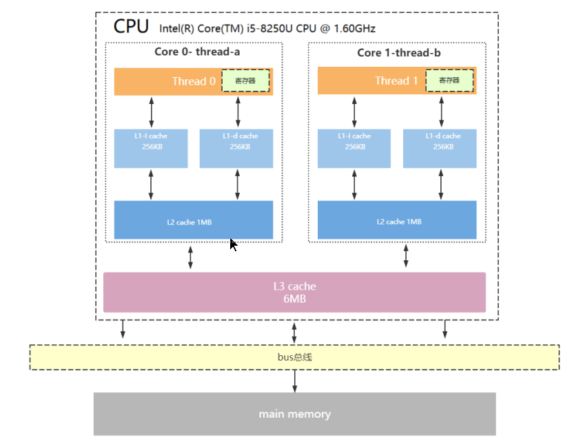
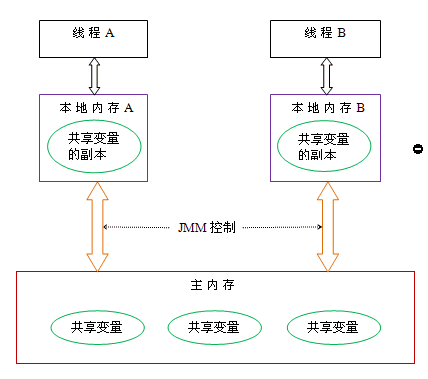

## 一、CPU架构

现代CPU一般会采用多核模式，每个内核可以独立工作。多核CPU架构图如下：



 为了均衡内存与CPU之间的速度差异，CPU中设计了多级缓存L1,L2,L3。

### 1.1 CPU多级缓存

- L3缓存：L3缓存容量最大，速度最慢，是多个核心间共享的内存。

- L2缓存：L2缓存容量适中，速度较快，内核独享。

- L1缓存：L1缓存容量最小，速度最快，内核独享。L1缓存内部分为两部分，一部分存储指令单元，一部分存储数据单元。

CPU多级缓存速度大小：寄存器 > L1 > L2 > l3 > 内存

>知识点：缓存是由最小的存储区块--缓存行（cacheLine）组成，缓存行的大小通常为64byte。
> 
>eg: L1缓存大小为512kb，而cacheLine=64byte，则L1有512kb * 1024 / 64个cacheLine。

### 1.2 局部性原理

在CPU访问存储设备时，无论是存取数据还是存储指令，都趋于聚集在一片连续的区域内，被称为局部性原理。

- 时间局部性（Temporal Locality）：如果一个信息项正在被访问，那么在近期很可能还会被再次访问。

- 空间局部性（Spatial Locality）：如果一个存储器的位置被引用，那么将来他附件的位置也会被引用。

## 二、为什么需要多线程？

在计算机中，CPU、内存、IO设备的速度是有很大差异的，为了提高CPU的利用率，平衡3者的速度差异，计算机体系结构、操作系统
编译程序都做出了贡献，主要表现为：

- CPU增加了缓存，均衡与内存的速度差异，导致了可见性问题

- 操作系统增加了进程、线程用于分时复用CPU，均衡CPU与IO设备的差异，出现了原子性问题

- 编译程序优化了指令执行次序，使得缓存能够得到更加合理的利用，导致了有序性问题

### 2.1 并发三要素

1. 原子性

**原子性是指一个或多个操作，要么全部执行完成并且执行过程中不被任何因素打断，要么不执行。**

原子性引发的线程安全问题，在多线程的环境中，对共享变量做操作（操作由多个操作组成），可能会由于线程间的切换导致线程安全问题。
简单来说引发原子性问题的原因是由于CPU分时复用造成的。

案例：

```java
// 共享遍历
int i=1;

public void factor(){
    i+=1;
}
```
> 注意i+=1操作是分为三部完成的
> 
> 1. 获取i本身值
> 2. 将i与1相加
> 3. 将相加后的值赋给i

现有线程A和线程B，线程A首先执行方法factor()，当线程A执行完第2步，（此时i仍=1）；CPU切换到线程B开始执行方法factor()，知道线程B执行完factor()后，
CPU才切换到线程A（此时i=?）。

我们希望得到的正确结果是i=3，因为两个线程都执行的factor()方法，相当于i=1+1+1=3。但是如果发生上述情况，则i=2。当执行完线程B后i=2，CPU切换回
线程A，此时将继续执行线程A没有执行完的操作（开始执行第3步,此时i=3）将i+1赋值给i(i=2)，最终写入内存的数是i=2。

2. 可见性

**可见性是指一个线程对共享变量的操作，另一个线程能立即看到。**

可见性引发的线程安全问题，在现代CPU架构中会设计多级缓存，CPU会从缓存中获取数据，将数据写入缓存，可能就会造成缓存数据与内存数据不一致问题。

案例：

```java
//线程A执行的代码
int i = 0;
i = 10;
 
//线程B执行的代码
j = i;
```
假若执行线程1的是CPU1，执行线程2的是CPU2。由上面的分析可知，当线程1执行 i =10这句时，会先把i的初始值加载到CPU1的高速缓存中，然后赋值为10，那么在CPU1的高速缓存当中i的值变为10了，却没有立即写入到主存当中。此时线程2执行 j = i，它会先去主存读取i的值并加载到CPU2的缓存当中，注意此时内存当中i的值还是0，那么就会使得j的值为0，而不是10.这就是可见性问题，线程1对变量i修改了之后，线程2没有立即看到线程1修改的值。# 原子性: 分时复用引起

3. 有序性

**有序性是指程序的执行顺序是按照代码的先后顺序执行的**

在程序执行时，为了提高性能，编译器和处理器会对指令做重排序，重排序分为3中类型：

- 编译器优化的重排序，编译器在不改变单线程程序语义前提下，可以重新安排预计的执行顺序。

- 指令级并行的重排序，现代处理器采用了指令级并行计数，将多条指令重叠执行，如果不存在数据依赖性，处理器可以改变语句对应机器指令的执行顺序。

- 内存系统的重排序。由于处理器使用缓存和读 / 写缓冲区，这使得加载和存储操作看上去可能是在乱序执行。

上述1属于编译器重排序，2和3属于处理器重排序。这些重排序都可能会导致多想成程序出现可见性问题。对于编译器，JMM的编译器重排序规则会禁止特定类型的编译器重排序
（不是所有的编译器重排序都要禁止）。对于处理器重排序，JMM的处理器重排序规则会要求Java编译器在生成指令序列时，插入特定的类型的内存屏障（memory barriers）
通过内存屏障指令来禁止特定类型的处理器重排序（不是所有的处理器重排序都需要禁止）。


## 三、Java如何解决并发问题（Java内存模型）

### 3.1 并发编程模型的分类

在并发编程中，我们需要处理两个关键问题：线程间如何通信以及线程间如何同步。通信是指线程之间以何种机制交换信息。
在命令式编程中，线程之间的通信机制有两种：共享内存和消息传递

### 3.2 Java内存模型的抽象

在Java中，所有的实例域、静态域和数组元素存储在堆内存中，堆内存在线程之间共享；局部变量，方法参数，异常处理器参数不会存在线程之间共享，
不会存在内存可见性问题，也不会受内存模型影响。

Java线程之间的通信由Java内存模型（JMM）控制，JMM决定一个线程对共享变量的写入何时对另一个线程可见。
从抽象角度来看，JMM定义了线程和主内存之间的抽象关系：线程之间的共享变量存在主内存中（main memory），
每个线程都有一个私有本地内存（local memory），本地内存中存储了该线程已经读/写共享变量的副本。本地内存
是JMM的一个抽象概念，并不真是存在，它涵盖了缓存，写缓存，寄存器以及其他硬件和编译器优化。JMM抽象图如下:



从上图来看，线程A与线程B之间要通信，需要经过两个步骤：
1. 线程A将本地内存A中更新过的共享变量刷新到主内存中
2. 线程B从主内存中读取线程A之前更新过的共享变量

### 3.3 处理器重排序与内存屏障指令

现代处理器使用写缓冲区来临时保存向内存写入的数据，写缓冲区可以保证指令流水线持续运行，它可以避免由于处理器停顿下来等待向内存写入数据而产生的延迟。
同时，通过以批处理的方式刷新写缓冲区，以及合并写缓冲区中对同一内存地址多次写，可以减少对内存总线的占用。虽然缓冲区有这么多好处，但是每个处理器上的缓冲区，
仅对它所在的处理器可见。这个特性会内内存操作的执行顺序产生影响，处理器对内存的读写操作的执行顺序，比一定与内存实际发送的读写操作顺序一致。

### 3.4 总结理解

从本质上来说，JMM规范了JVM如何提供按需禁用缓存和编译优化的方法，具体来说包括：

- volatile synchronize final三个关键字

- Happens-Before规则

从另一个角度理解，引发线程安全问题无非是 原子性问题、有序性问题、可见性问题。那么解决线程安全问题从这三方面入手解决。

1. 原子性问题

Java中，只保证对基本类型的变量的读取和赋值操作是原子性操作，这些操作不可以被中断。

> 如果需要保证更大范围操作的原子性，可以使用synchronized和Lock实现

2. 可见性问题

Java提供了volatile关键字保证可见性。

一个变量被volatile修饰时，它会保证修改的值立刻被更新到主存中，当其他线程需要读取时，它会从内存中去读取新值。

另外，通过synchronized和Lock也能保证可见性，synchronized和Lock能保证同一时刻只有一个线程获取锁然后执行同步代码，并且在释放锁之前会将对变量的修改
刷新到主存中，可以保证可见性。

3. 有序性问题

Java中可以通过volatile关键字保证一定的有序性；
synchronized和Lock也可以保证有序性；
JMM通过Happens-Before规则保证有序性；

## 4. 线程安全

线程安全不是一个非真既假的命题，可以将共享数据按照安全的程度分成五类：不可变、绝对线程安全、相对线程安全、线程兼容、和线程对立。

### 4.1 不可变

不可变（immutable）的对象一定是线程安全的，不需要采取任何的线程安全保障措施，只要一个不可变的对象被正确的构建出来，
就不会被改变。

不可变类型：

- final关键字修饰的基本数据类型

- String

- 枚举类型

- Number部分子类，如 Long 和 Double 等数值包装类型，BigInteger 和 BigDecimal 等大数据类型。但同为 Number 的原子类 AtomicInteger 和 AtomicLong 则是可变的。

对于集合类型，可以使用 Collections.unmodifiableXXX() 方法来获取一个不可变的集合。

### 4.2 绝对线程安全

不管运行时环境如何，调用者都不需要任何额外的同步措施

### 4.3 相对线程安全

相对线程安全需要保证对这个对象单独的操作是线程安全的，在调用时不需要做额外的保障措施，但是对于一些特定顺序的联系调用，就可能出现线程安全问题。

大部分线程安全的集合都是这种类型：Vector、HastTable等。


### 4.4 线程兼容

线程兼容是指对象本身并不是线程安全的，但是可以通过在调用端正确的使用同步手段来保证对象在并发环境中可以安全的使用。
Java中API大部分是线程兼容的。

### 4.5 线程对立

线程对立是指无论调用端是否采取了同步措施，都无法在多线程环境中并发使用代码。应该避免这种情况

## 6. 线程安全的实现方法

### 6.1 互斥同步

采用锁的方式，保证线程安全。这种方式是阻塞的，同一个锁的多个线程，一个线程执行，其他线程只能阻塞等待。

互斥同步主要的问题是线程阻塞和唤醒所带来的性能问题。

互斥同步属于一种**悲观的并发策略**，无论共享数据是否真的出现竞争，都进行加锁、用户态核心态转换、线程唤醒等操作。

### 6.2 无阻塞同步

#### CAS

基于冲突检测的**乐观并发策略**：先进行操作，如果没有其他线程竞争共享数据，则操作成功，否则采取补偿措施（不断重试，知道成功为止）。
这种乐观的并发策略许多实现都不需要将线程阻塞，所以被称为非阻塞同步。

乐观锁需要操作和冲突检测两个步骤具备原子性，这里就不能再使用互斥同步来保证了，而是靠硬件完成，硬件支持的原子性操作最典型的是
比较并交换（compare-and-swap CAS）,CAS有3个操作数，分别是内存地址V，旧的预期值A和新值B，只有当V的值等于A，才会将V的值更新为B，

#### JDK中的CAS

J.U.C包中的原子类AtomicXXX，都有CAS方法，例如AtomicInteger类的#compareAndSet()和getAndIncrement()方法都使用了Unsafe类的CAS操作。

#### CAS的ABA问题

如果一个变量初始读取的时候是A值，它的值被改为B，后又被改回A，那么CAS操作就会误认为它没有被修改过。

### 6.3 无同步方案

1. 栈封闭

2. 线程本地存（ThreadLocal）

3. 可重入代码

## 参考

> 
>著作权归@pdai所有
>原文链接：https://pdai.tech/md/java/thread/java-thread-x-theorty.html
>