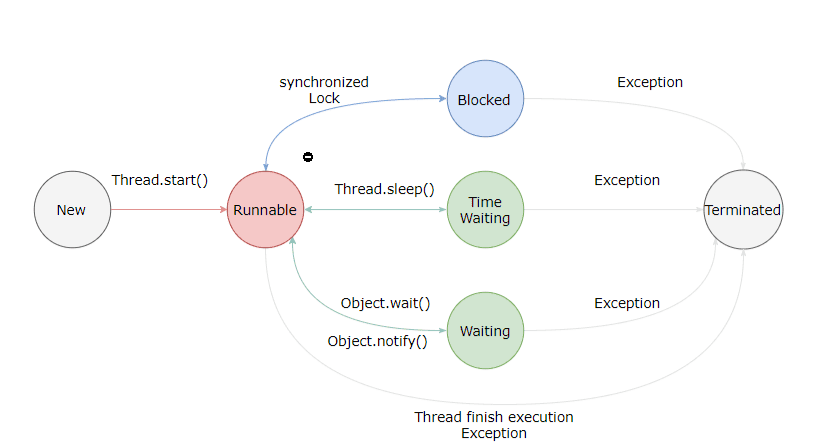

# 目录

# 面试问题
- 线程有哪几种状态？从一种状态到另一种状态转变方式有哪些？

- 通常线程有哪几种使用方式？

- 基础线程机制有哪些？

- 线程的中断方式有哪些？

- 线程的互斥同步方式有哪些？如何选择？

- 线程之间有哪些协作方式？

# 一、线程状态及转换

- 新建（NEW），创建的线程，但是为启动线程

- 就绪/可运行（RUNNABLE），线程可能在运行，也可能在等待CPU时间片（调用了thread.start()）。包含了操作系统的running和ready状态。

- 阻塞（BLOCKING），等待获取一把排他锁，如果获取到锁就会结束此状态

- 无限等待（WAITING），等待其他线程唤醒，否则不会被分配CPU时间片

|进入方法|退出方法| 
|没有设置timeout的Object.wait()方法|Object.notify()或Object.notifyAll|
|没有设置timeout的Thread.join()方法|被调用的线程执行完毕|
|LockSupport.park()方法|-|

- 超时等待（TIME-WAITING），在超时时间内如果没有被唤醒，会被自动唤醒

|进入方法|退出方法|
|Thread.sleep()方法|时间结束|
|设置了timeout的Object.wait()方法|时间结束 / Object.notify() / Object.notifyAll()|
|设置了 Timeout 参数的 Thread.join()方法|时间结束 / 被调用的线程执行完毕|
|LockSupport.parkNanos()方法|-|
|LockSupport.parkUntil()方法|-|

- 死亡（TERMINATED），线程结束

# 二、线程使用方式

有三种使用线程的方法：

- 实现Runnable接口

- 实现Callable接口

- 继承Thread类

Runnable和Callable接口都是线程任务接口，并不是真正意义的线程，因此最后还是需要通过Thread类来调用。

Runnable和Callable接口相比，Callable接口的run()方法可以有返回值，返回值可以通过FutureTask进行封装；Callable接口的run()方法也可以抛出异常。

# 三、线程中断

一个线程再执行完毕之后会自动结束，如果在运行过程中发生异常也会提前结束。

## 3.1 interrupt()

通过调用一个线程的interrupt()来标记一个线程中断，如果该线程处于阻塞、超时等待、无限等待，就会抛出interruptedException，从而提前结束线程。
不能中断IO阻塞和锁阻塞。

## 3.2 interrupted()

如果一个线程run()方法无限循环执行，且线程中没有执行可中断操作，就不能调用线程的interrupt()方法结束线程。
但是调用interrupt()方法会给线程设置一个中断标记，此时调用Interrupted()方法会返回true。interrupted()会清除中断标记。